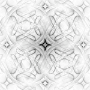

# Minimal examples for calcQPI

This is a repository of minimal tight-binding models to demonstrate the capabilities of calcQPI in calculating QPI patterns. The examples are described in the preprint at https://arxiv.org/abs/2507.22137

Homepage: https://wahl.wp.st-andrews.ac.uk/calcqpi

Github: https://github.com/gpwahl/calcqpi-release (version accompanying preprint)

The minimal models test a range of functionalities of calcQPI, including calculation of surface states, Rashba spin splitting, topogically protected surface states, nearest neighbour tight-binding models on square and hexagonal lattices, and calculations of Bogoljubov quasi-particle interference.

The folders are:

* 1nn 	    nearest neighbour model on a square lattice in 2D
* 1nn-hex	    nearest neighbour model on a hexagonal lattice in 2D
* 1nnz        nearest neighbour model on a square lattice with non-negligible out-of-plane coupling
* rashba	    nearest neighbour model with Rashba term (through non-local spin-orbit coupling)
* ssh         nearest neighbour model where the out of plane coupling is alternating as in an SSH-chain, creating a surface state
* topo        nearest neighbour model of a topological insulator, again with non-local spin-orbit coupling
* 1nn-sc      nearest neighbour model with a dx2 superconducting gap
* 1nn-josephson as 1nn-sc, but with configuration files to simulate Josephson current as would be measured with a superconducting tip
* sr2ruo4     QPI calculation for Sr2RuO4, as in fig. 12 of the preprint (though with lower resolution and not including the experimental data). In the sub-folder 'wannnierization' we provide an example for how to obtain the tight-binding model and wave function files from DFT calculations

To run the simulations, calcQPI is required, and to generate the figures, an installation of python3 with numpy and matplotlib. The file config.mk contains the path to calcQPI and mkwavefunctions, which are required to run the simulations. All simulations can be run by just typing make

Note that the plotting part requires python 3.9 or later and matplotlib.
